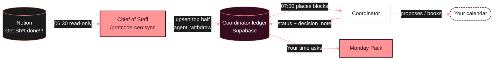

# PRNTCODE CEO agent


Khaled's PRNTCODE agent, **v1**. The **CEO** is a thin router. The **Chief of Staff** is the one live role:

- **Sync** (`/prntcode-ceo:sync`, daily at **06:30 Abu Dhabi**): reads the team tracker "Get Sh\*t done!!!", picks the tasks that need a block of *your* time, and posts them to your Coordinator. That happens 30 minutes before the Coordinator's 07:00 run.
- **Monday Pack**: the same pack as before, plus a new **Your time asks** section showing what the Coordinator did with each ask.

The other seven departments have a charter only: what they'll own and which existing skills will move under them. See [`plugins/prntcode-ceo/org/`](plugins/prntcode-ceo/org/README.md).

## The loop



---

## 1. Install (one time, about 3 minutes)

On a laptop, in **claude.ai**:

1. Click your **name/initials** (bottom-left) → **Customize**.
2. Open the **Plugins** tab.
3. Click **Add marketplace**.
4. Paste `thevault-dev/prntcode-ceo` and confirm.
5. Turn **Sync automatically** **on**. Updates then arrive by themselves.
6. Find **prntcode-ceo** in the list and click **Install**.
7. Check it worked: start a new chat, type `/prntcode-ceo:` and you should see **sync**, **monday-pack** and **ceo**.

**Turn off the old Monday Pack** so two copies don't compete:
**Customize → Skills →** find the standalone **monday-pack** → switch it **off**. The plugin's copy is the same skill plus *Your time asks*.

## 2. Connectors (one time)

Both are in **Customize → Connectors**.

**Notion**
1. If Notion isn't listed as connected, click **Notion → Connect** and sign in.
2. On Notion's permission screen, pick the **Prntcode** workspace and allow access to the **Prntcode** pages. That covers "Trackers & Tings", "Get Sh\*t done!!!" and "The Game Plan…".
3. Make sure Notion's tools are **enabled** (the toggle next to the connector).

**Supabase**
1. Click **Supabase → Connect** and sign in with the account that owns the **coordinator** project.
2. Allow access to the organization that holds the **coordinator** project.
3. Make sure the toggle is **on**.

Quick test: in a new chat, type **"sync my PRNTCODE time"**. If a connector is missing, the agent names it and writes nothing.

## 3. The 06:30 scheduled task (one time)

In the **Claude desktop app** (Cowork):

1. Open **Cowork** (left sidebar).
2. Click **Scheduled** → **New task**.
3. **Name:** `PRNTCODE sync`
4. **Prompt:** `/prntcode-ceo:sync`
5. **Frequency:** **Daily**. **Time:** **06:30**.
6. **Time zone:** make sure it's Abu Dhabi (**GMT+4**). If your computer's clock is set to another zone, convert. For example, from London in winter (GMT+0), set **02:30**.
7. Click **Save**.

Leave the Claude app running with the laptop awake (or set to wake). A scheduled task only runs while the app is open.

**Monday Pack schedule:** if you already have a Monday-morning task that runs the old Monday Pack, open it (**Cowork → Scheduled →** that task **→ Edit**) and change its prompt to `/prntcode-ceo:monday-pack`.

---

## Using it

| Say | What happens |
|---|---|
| `sync my PRNTCODE time` or `/prntcode-ceo:sync` | Runs the sync now and replies with the summary |
| `monday pack` or `/prntcode-ceo:monday-pack` | The Monday Pack, with **Your time asks** |
| `drop X` (after a sync lists a booked block you no longer need) | Say it to your **Coordinator**, which owns the calendar. The PRNTCODE agent can't remove booked blocks. |

### What the sync summary looks like

```
PRNTCODE sync — Fri 2 Oct, 06:30
Posted 3 · Updated 1 · Withdrawn 1 · Skipped 9 · Unchanged 6

Posted
• Review Deepwear redlines — Deepwear — 90m · due Sun 11 Oct
Updated
• POS setup — Cactus District Round 2 — due 16 Oct → 23 Oct (duration kept)
Withdrawn
• Issue the PO — WILDFLOWER SUMMER — marked done
Booked but no longer needed
• Book the factory visit — WILDFLOWER SUMMER (Mon 5 Oct 10:00).
  Booked but no longer needed. Say "drop Book the factory visit" to remove it.
Skipped
• Overdue (2): Set pricing (was due 16 Sep) · …
• Undated (1): …
• Over cap (1): …
• No block needed (4): Invite to Mirbad (quick errand) · …
```

## How the sync decides

1. **Candidates:** tasks where **you** are in `Assigned to` and `Status` isn't `!!وصلنا`. Tasks assigned only to Hessa or Harizel are never touched.
2. **Needs your time?** The agent guesses, and no new Notion fields are needed. Reviewing, deciding, writing, calls and prep count. Errands under about 15 minutes, and work someone else carries out, don't.
3. **How long?** It estimates 30 to 240 minutes in 30-minute steps. The reasoning goes into the ledger as one line, e.g. `Est. 90m: review Deepwear redlines + reply`.
4. **Due date:** the task's due date. A date with no time means **23:59 Abu Dhabi**. If the task has no date, it uses the project's D-Day. If neither exists, the task is skipped and listed as **undated**. Past-due tasks are skipped and listed as **overdue**; they're never posted.
5. **Stable:** it reads the ledger first and writes only when the **title or due date** changed in Notion. Once posted, the duration and priority are **never re-guessed**. A second run with no Notion changes writes **zero** rows.
6. **Cap:** at most **8 new posts per run**, earliest due first. The rest are listed and tried again tomorrow.
7. **Withdraw:** a posted task that's marked done, deleted, or unassigned from you is withdrawn from the Coordinator. If the Coordinator already **booked** it, it's left alone and listed so you can decide.
8. Recurring items ("weekly…") are skipped, because Coordinator intake handles them.

### Priority mapping

The tracker's `Priority` is a Notion formula. On **2 Oct 2026** the Notion connector returned it only as an unreadable reference (`formulaResult://…`) for every task, so it can't be read today. The mapping:

| Priority shows | Ledger priority |
|---|---|
| Urgent / Critical / 🔥 / 🔴 / P0 | 1 |
| High / 🟠 / P1 | 2 |
| Medium / Normal / 🟡 / P2 | 3 |
| Low / 🟢 / P3 | 4 |
| Someday / ⚪ / P4 | 5 |
| **Unreadable (today)** | **3** |

In practice, every post gets priority **3** until Notion exposes the formula's value. The Coordinator still sees each task's due date.

## The ledger contract (what this agent writes)

Coordinator ledger: Supabase project `coordinator` (`hgkreprqxevayruqpibf`), table `public.requests`. The contract is defined in the Coordinator's README. This agent uses **only** these two write paths:

**1. Upsert, top half only**, keyed on (`source_agent`, `source_ref`):

| Column | Value |
|---|---|
| `source_agent` | `prntcode` |
| `sub_agent` | `chief_of_staff` |
| `source_ref` | Notion page ID (dashed UUID) |
| `title` | `<Task> — <Project>` |
| `context` | `Est. <N>m: <what for>` |
| `duration_min` | 30–240, steps of 30 |
| `earliest_start` | time of the run |
| `due_by` | as above, stored in UTC |
| `flexibility` | `flexible` |
| `priority` | 1–5, as above |

On conflict, it only ever changes `title` and `due_by`, and only when one of them actually changed and the row is `new`, `proposed` or `scheduled`.

**2. `public.agent_withdraw(p_source_agent, p_source_ref, p_reason)`**: moves a `new` or `proposed` row to `declined` with the note `withdrawn by prntcode: <reason>`. It refuses `scheduled` rows and rows it can't find, and is granted to `service_role` only.

It never writes the bottom half (`status`, `slot_*`, `calendar_event_id`, `decision_note`, `decided_at`) and never writes a calendar.

### Coordinator migration status

`agent_withdraw` is **live** in the ledger: migration `20260930191251 agent_withdraw`. On 2 Oct 2026 it was checked against the live database: it declines new/proposed rows with the right note, refuses scheduled and missing rows, and is executable by `service_role` and `postgres` only. The repo-side changes in `thevault-dev/coordinator` (README, plugin version bump, `supabase/tests/definition_of_done.sql`) are tracked in [`docs/coordinator-handoff.md`](docs/coordinator-handoff.md).

### Self-test

[`tests/prntcode_contract_check.sql`](tests/prntcode_contract_check.sql) proves the contract end to end, with first post, zero-write re-run, due-date-only update, withdraw, and both refusals. It rolls itself back, so it never leaves a row behind.
To run it: **Supabase → coordinator → SQL Editor → New query →** paste the file **→ Run**. The result should read `ALL PRNTCODE CONTRACT CHECKS PASSED`.

---

## What's in this repo

```
.claude-plugin/marketplace.json        the marketplace (one plugin)
plugins/prntcode-ceo/
  .claude-plugin/plugin.json
  skills/
    ceo/                               CEO: thin router
    sync/                              Chief of Staff: Notion → ledger feed
    monday-pack/                       Chief of Staff: Monday Pack (+ Your time asks)
  org/                                 one charter README per role (9)
docs/org-chart.svg                     the chart above
docs/coordinator-handoff.md            what the coordinator repo needs
tests/prntcode_contract_check.sql      ledger contract self-test
```

## Not in v1

Guess-accuracy tracking (planned for the Auditor), reopening declined items when the due date moves, and real work from any department other than the Chief of Staff.

## Troubleshooting

| Symptom | Fix |
|---|---|
| `/prntcode-ceo:sync` doesn't appear | Customize → Plugins → check **prntcode-ceo** is installed and on. Then start a **new** chat. |
| "Notion connector missing" / "Supabase connector missing" | Section 2 above. |
| The Monday Pack shows twice, or the old version runs | Turn off the standalone **monday-pack** skill (section 1). |
| The 06:30 sync didn't run | The Claude app was closed or the laptop asleep. Run `sync my PRNTCODE time` by hand; it's safe to run any time. |
| A task you need time for was "No block needed" | Add a word to the task title or Notes that makes it clear you must do it ("review…", "decide…", "write…"). The next sync re-judges it. |

**Version:** 1.0.0
