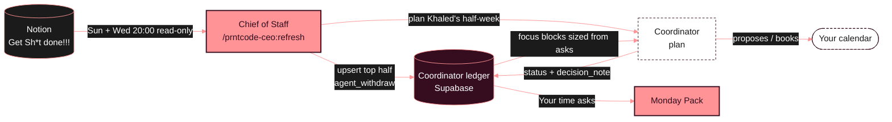

# PRNTCODE CEO agent


Khaled's PRNTCODE agent, **v2.0.0** (half-week planning, 4 Oct 2026). The **CEO** is a thin router. The **Chief of Staff** is the one live role:

- **Refresh** (`/prntcode-ceo:refresh`, **Sun and Wed 20:00 Abu Dhabi**): reads the team tracker "Get Sh\*t done!!!", decides which of *your* tasks need your time in the coming half-week, and posts them to your Coordinator ledger. Then it shows a ≤5-line PRNTCODE pre-brief, flags your tasks with no D-Day, and on Sundays links the Monday Pack. It ends with `plan Khaled's half-week`, so the Coordinator starts planning in the same chat. It replaces the daily 06:30 sync.
- **What now** (the `what-now` skill): in a focus block, say "what do you need from me now?", "PRNTCODE focus, what's next?" or "I have 90 minutes, what should I do?". You get the 1–3 tasks that fit your time, each with its first concrete step. Reply `done` (closes it in the tracker), `next` or `skip`.
- **Close task** (`/prntcode-ceo:close-task`): when you tell the Coordinator's digest a PRNTCODE item is done or not needed, the Chief of Staff closes that one task in the tracker straight away. See [Closing a task from the digest](#closing-a-task-from-the-digest).
- **Monday Pack**: the same pack as before, plus a new **Your time asks** section showing what the Coordinator did with each ask.

The other seven departments have a charter only: what they'll own and which existing skills will move under them. See [`plugins/prntcode-ceo/org/`](plugins/prntcode-ceo/org/README.md).

## The loop



---

## 1. Install (one time, about 3 minutes)

On a laptop, in **claude.ai**:

1. Click your **name/initials** (bottom-left) → **Customize**.
2. Open the **Plugins** tab.
3. Click **Add marketplace**.
4. Paste `thevault-dev/prntcode-ceo` and confirm.
5. Turn **Sync automatically** **on**. Updates then arrive by themselves.
6. Find **prntcode-ceo** in the list and click **Install**.
7. Check it worked: start a new chat, type `/prntcode-ceo:` and you should see **refresh**, **what-now**, **close-task**, **monday-pack**, **ceo** and the retired **sync** stub.

**Turn off the old Monday Pack** so two copies don't compete:
**Customize → Skills →** find the standalone **monday-pack** → switch it **off**. The plugin's copy is the same skill plus *Your time asks*.

## 2. Connectors (one time)

Both are in **Customize → Connectors**.

**Notion**
1. If Notion isn't listed as connected, click **Notion → Connect** and sign in.
2. On Notion's permission screen, pick the **Prntcode** workspace and allow access to the **Prntcode** pages. That covers "Trackers & Tings", "Get Sh\*t done!!!" and "The Game Plan…".
3. Make sure Notion's tools are **enabled** (the toggle next to the connector).

**Supabase**
1. Click **Supabase → Connect** and sign in with the account that owns the **coordinator** project.
2. Allow access to the organization that holds the **coordinator** project.
3. Make sure the toggle is **on**.

Quick test: in a new chat, type **"sync my PRNTCODE time"**. If a connector is missing, the agent names it and writes nothing.

## 3. Scheduled tasks (v2: Sunday and Wednesday 20:00)

**Switch off the old one:** **Cowork → Scheduled → "PRNTCODE sync"** (`/prntcode-ceo:sync`, daily 06:30) → turn it off or delete it. Also switch off the Coordinator's **07:00** `/coordinator:daily-run` task. If either fires anyway, it only replies "retired, switch me off".

**Create two new tasks** (Cowork → Scheduled → New task, time zone Abu Dhabi GMT+4). Both plugins must be installed. Each one runs the refresh, which ends by starting Coordinator planning in the same chat:

| Name | When | Prompt |
|---|---|---|
| `PRNTCODE + plan (Sun)` | Weekly, Sunday 20:00 | see `BUILD_REPORT_PLANNING_V2.md` in the coordinator repo (copy exactly) |
| `PRNTCODE + plan (Wed)` | Weekly, Wednesday 20:00 | same file |

The run stops at the Coordinator's "Anything else booked?" and waits for your reply in that task's chat.

**Monday Pack:** on Sundays the refresh makes it as its own artifact and links it in one line. You can turn off any separate Monday-morning pack task, or keep it if you still want it on Monday morning.

---

## Using it

| Say | What happens |
|---|---|
| `refresh PRNTCODE` or `/prntcode-ceo:refresh` | Runs the half-week refresh now: pre-brief, then the Coordinator plan |
| `what do you need from me now?` · `PRNTCODE focus, what's next?` · `I have 90 minutes, what should I do?` | 1–3 tasks that fit your time, each with a first step. Then `done` / `next` / `skip` |
| `show details` (after a refresh) | The full Posted / Updated / Withdrawn / Skipped lists |
| `monday pack` or `/prntcode-ceo:monday-pack` | The Monday Pack, with **Your time asks** |
| `close PRNTCODE task <ref> as not_needed: <reason>` | Closes that one tracker task (normally sent by the Coordinator for you) |
| `drop X` (after a sync lists a booked block you no longer need) | Say it to your **Coordinator**, which owns the calendar. The PRNTCODE agent can't remove booked blocks. |

### What the v1 sync summary looked like (now `show details` after a refresh)

```
PRNTCODE sync — Fri 2 Oct, 06:30
Posted 4 · Updated 1 · Withdrawn 1 · Skipped 9 · Unchanged 6

Posted
• Review Deepwear redlines — Deepwear — 90m · due Sun 11 Oct
• ⏰ Set pricing — Wildflower - Abayas — 60m · catch-up by Mon 5 Oct (was due 16 Sep)
Updated
• POS setup — Cactus District Round 2 — due 16 Oct → 23 Oct (duration kept)
Withdrawn
• Issue the PO — WILDFLOWER SUMMER — marked done
Booked but no longer needed
• Book the factory visit — WILDFLOWER SUMMER (Mon 5 Oct 10:00).
  Booked but no longer needed. Say "drop Book the factory visit" to remove it.
Skipped
• Overdue (2): Story collection page (WOB) (22 May, >21 days) · Projectors (project not active)
• Undated (1): …
• Over cap (1): …
• No block needed (4): Invite to Mirbad (quick errand) · …
```

## How the sync decides

1. **Candidates:** tasks where **you** are in `Assigned to` and `Status` isn't `!!وصلنا`. Tasks assigned only to Hessa or Harizel are never touched.
2. **Needs your time?** The agent guesses, and no new Notion fields are needed. Reviewing, deciding, writing, calls and prep count. Errands under about 15 minutes, and work someone else carries out, don't.
3. **How long?** It estimates 30 to 240 minutes in 30-minute steps. The reasoning goes into the ledger as one line, e.g. `Est. 90m: review Deepwear redlines + reply`.
4. **Due date:** the task's due date. A date with no time means **23:59 Abu Dhabi**. If the task has no date, it uses the project's D-Day. If neither exists, the task is skipped and listed as **undated**.
5. **Overdue → catch-up, not ignored.** A missed deadline can't be booked as it is, because the Coordinator places blocks *before* `due_by`. So a task that is overdue by **21 days or less**, on a project that's **In progress** or **Always on…**, gets a **catch-up block**:
   - due **3 days from today** (or the project's D-Day, if that's sooner),
   - priority **2**,
   - context starting `Overdue since 16 Sep — catch-up…`.

   It's posted once. The catch-up date is never pushed again, and if you re-date the task in Notion, the sync follows your new date. Older overdue tasks, or ones on projects that are on hold, not started or done, are listed as **overdue** with the reason, so they still reach you.
6. **Stable:** it reads the ledger first and writes only when the **title or due date** changed in Notion. Once posted, the duration and priority are **never re-guessed**. A second run with no Notion changes writes **zero** rows.
7. **Cap:** at most **8 new posts per run**, catch-ups included, earliest due first. The rest are listed and tried again tomorrow.
8. **Withdraw:** a posted task that's marked done, deleted, or unassigned from you is withdrawn from the Coordinator. If the Coordinator already **booked** it, it's left alone and listed so you can decide.
9. Recurring items ("weekly…") are skipped, because Coordinator intake handles them.

### Priority mapping

The tracker's `Priority` is a Notion formula. On **2 Oct 2026** the Notion connector returned it only as an unreadable reference (`formulaResult://…`) for every task, so it can't be read today. The mapping:

| Priority shows | Ledger priority |
|---|---|
| Urgent / Critical / 🔥 / 🔴 / P0 | 1 |
| High / 🟠 / P1 | 2 |
| Medium / Normal / 🟡 / P2 | 3 |
| Low / 🟢 / P3 | 4 |
| Someday / ⚪ / P4 | 5 |
| **Unreadable (today)** | **3** |

In practice, every post gets priority **3** until Notion exposes the formula's value. The exception is catch-ups, which always get **2**. The Coordinator still sees each task's due date.

## Closing a task from the digest

When the Coordinator's digest shows a PRNTCODE task that's already done or no longer needed, you reply in that chat (e.g. `2 not needed — her visa came through`). The Coordinator never writes to Notion, so it hands the item to this agent, which closes **only that task**:

1. Checks the ledger row is a PRNTCODE request, and its `source_ref` is a page in **Get Sh\*t done!!!**. Anything else is refused.
2. Sets **Status**: `done` → `!!وصلنا`; `not_needed` → a Cancelled / Not-needed status **if the tracker has one**, otherwise `!!وصلنا`. Today there is none (options: Not started, On hold, In progress, !!وصلنا). Add one in Notion if you want "not needed" kept separate; the agent picks it up automatically. It never creates status options itself.
3. Adds one comment: `Closed by Khaled via Coordinator digest — not needed: her visa came through — 3 Oct 2026`.
4. Stamps the ledger (`agent_mark_tracker_closed`) and replies in one line: `Closed in tracker: Backup for Harizel — not needed (her visa came through)`.

Already closed → nothing changes, and it says so. No other task, property or page is touched. Your reply is the approval; it doesn't ask again.

**Safety net.** If the instant close fails (Notion down, chat closed), the row keeps `resolution` set with no `tracker_closed_at`. The next `sync` closes it the same way and lists it under *Closed in tracker*.

**The other way round.** Close a task by hand in Notion and the next `sync` withdraws its open ledger request (`withdrawn by prntcode: task marked done in Notion`), so it drops off the digest. A block that's already **booked** is left alone and listed, as before.

### Handoff contract (for the Coordinator)

The Coordinator asks for a close with one line per item, in the same chat:

```
close PRNTCODE task <source_ref> as <done|not_needed>: <reason>
```

| Part | Value |
|---|---|
| `<source_ref>` | the ledger row's `source_ref` (Notion page ID, dashed UUID). The row's `id` also works. |
| outcome | `done` for `resolution = done_elsewhere`, `not_needed` for `resolution = not_needed` |
| `<reason>` | Khaled's words, unedited; `no reason given` if he gave none |

Equivalent: invoke the skill **`prntcode-ceo:close-task`** with that line as its argument.

What the Coordinator must do **before** handing off: set the row's `resolution` (its own function, next brief). That's what lets the safety net finish the job if the instant close fails. Keep Khaled's reason in `decision_note` after a `: ` so the safety net can quote it.

What comes back: exactly one line per item, one of
- `Closed in tracker: <task> — <done | not needed> (<reason>)`
- `Already closed in tracker: <task> — status <status>. Nothing changed.`
- `Not closed: <ref> isn't one of my PRNTCODE ledger requests.` / `Not closed: <ref> isn't a task in the PRNTCODE tracker.` / `Not closed: <error>`

What this agent never does: change the row's `status`, `resolution` or the Coordinator's bottom half. Status handling stays with the Coordinator. The sync also never withdraws a row that has `resolution` set.

## The ledger contract (what this agent writes)

Coordinator ledger: Supabase project `coordinator` (`hgkreprqxevayruqpibf`), table `public.requests`. The contract is defined in the Coordinator's README. This agent uses **only** these three write paths:

**1. Upsert, top half only**, keyed on (`source_agent`, `source_ref`):

| Column | Value |
|---|---|
| `source_agent` | `prntcode` |
| `sub_agent` | `chief_of_staff` |
| `source_ref` | Notion page ID (dashed UUID) |
| `title` | `<Task> — <Project>` |
| `context` | `Est. <N>m: <what for>` |
| `duration_min` | 30–240, steps of 30 |
| `earliest_start` | time of the run |
| `due_by` | as above, stored in UTC |
| `flexibility` | `flexible` |
| `priority` | 1–5, as above |

On conflict, it only ever changes `title` and `due_by`, and only when one of them actually changed and the row is `new`, `proposed` or `scheduled`.

**2. `public.agent_withdraw(p_source_agent, p_source_ref, p_reason)`**: moves a `new` or `proposed` row to `declined` with the note `withdrawn by prntcode: <reason>`. It refuses `scheduled` rows and rows it can't find, and is granted to `service_role` only.

**3. `public.agent_mark_tracker_closed(p_request_id)`**: stamps `tracker_closed_at = now()` after close-task closed the Notion task. Refuses rows that aren't `prntcode`'s and missing rows; calling it twice is harmless. It doesn't bump `updated_at`, so a stamped row never shows as "changed" in the digest. Migration `20261003081504 close_task_resolution`, which also adds `resolution` (`done_elsewhere` | `not_needed`, set by the Coordinator).

It never writes the bottom half (`status`, `slot_*`, `calendar_event_id`, `decision_note`, `decided_at`) and never writes a calendar.

### Coordinator migration status

`agent_withdraw` is **live** in the ledger: migration `20260930191251 agent_withdraw`. On 2 Oct 2026 it was checked against the live database: it declines new/proposed rows with the right note, refuses scheduled and missing rows, and is executable by `service_role` and `postgres` only. The repo-side changes in `thevault-dev/coordinator` (README, plugin version bump, `supabase/tests/definition_of_done.sql`) are tracked in [`docs/coordinator-handoff.md`](docs/coordinator-handoff.md).

### Self-test

[`tests/prntcode_contract_check.sql`](tests/prntcode_contract_check.sql) proves the contract end to end, with first post, zero-write re-run, due-date-only update, withdraw, and both refusals. It rolls itself back, so it never leaves a row behind.
To run it: **Supabase → coordinator → SQL Editor → New query →** paste the file **→ Run**. The result should read `ALL PRNTCODE CONTRACT CHECKS PASSED`.

---

## What's in this repo

```
.claude-plugin/marketplace.json        the marketplace (one plugin)
plugins/prntcode-ceo/
  .claude-plugin/plugin.json
  skills/
    ceo/                               CEO: thin router
    sync/                              Chief of Staff: Notion → ledger feed (+ close-task safety net)
    close-task/                        Chief of Staff: close one tracker task from the digest
    monday-pack/                       Chief of Staff: Monday Pack (+ Your time asks)
  org/                                 one charter README per role (9)
docs/org-chart.svg                     the chart above
docs/coordinator-handoff.md            what the coordinator repo needs
tests/prntcode_contract_check.sql      ledger contract self-test
```

## Not in v1

Guess-accuracy tracking (planned for the Auditor), reopening declined items when the due date moves, and real work from any department other than the Chief of Staff.

## Troubleshooting

| Symptom | Fix |
|---|---|
| `/prntcode-ceo:refresh` doesn't appear | Customize → Plugins → check **prntcode-ceo** is installed and on. Then start a **new** chat. |
| "Notion connector missing" / "Supabase connector missing" | Section 2 above. |
| The Monday Pack shows twice, or the old version runs | Turn off the standalone **monday-pack** skill (section 1). |
| The Sun/Wed 20:00 refresh didn't run | The Claude app was closed or the laptop asleep. Say `refresh PRNTCODE` by hand; it's safe to run any time, and it still hands over to planning. |
| A task you need time for was "No block needed" | Add a word to the task title or Notes that makes it clear you must do it ("review…", "decide…", "write…"). The next sync re-judges it. |

**Version:** 2.0.0 (half-week refresh with handoff to Coordinator planning, what-now, Monday Pack as an artifact; the daily sync is retired). The refresh keeps every v1 sync rule below; what changed is when it runs, the 'this half-week' filter (3f-bis), and the message it ends with.
