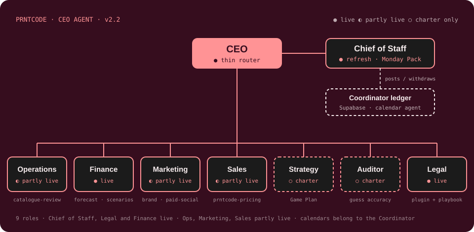

# PRNTCODE CEO agent



Khaled's PRNTCODE agent, **v2.3.0** (Finance goes live: forecast, scenarios, capital review and PO checks, 9 Oct 2026). The **CEO** is a thin router. The **Chief of Staff** is live:

- **Refresh** (`/prntcode-ceo:refresh`, **Sun and Wed 20:00 Abu Dhabi**): reads the team tracker "Get Sh\*t done!!!", decides which of *your* tasks need your time in the coming half-week, and posts them to your Coordinator ledger. Then it shows a ≤5-line PRNTCODE pre-brief, flags your tasks with no D-Day, and on Sundays links the Monday Pack. It ends with `plan Khaled's half-week`, so the Coordinator starts planning in the same chat. It replaces the daily 06:30 sync.
- **What now** (the `what-now` skill): in a focus block, say "what do you need from me now?", "PRNTCODE focus, what's next?" or "I have 90 minutes, what should I do?". You get the 1–3 tasks that fit your time, each with its first concrete step. Reply `done` (closes it in the tracker), `next` or `skip`.
- **Close task** (`/prntcode-ceo:close-task`): when you tell the Coordinator's digest a PRNTCODE item is done or not needed, the Chief of Staff closes that one task in the tracker straight away. See [Closing a task from the digest](#closing-a-task-from-the-digest).
- **Monday Pack**: the same pack as before, plus a new **Your time asks** section showing what the Coordinator did with each ask.
- **Meeting tasks** (`/prntcode-ceo:meeting-tasks`): Fellow action items into "Get Sh\*t done!!!", confirmed in a table before anything is written.

**Legal** is live too. It runs on Anthropic's **legal** plugin, installed from Anthropic's marketplace so it keeps updating. For any contract, NDA or legal question, the CEO reads PRNTCODE's playbook ([`org/legal/legal.local.md`](plugins/prntcode-ceo/org/legal/legal.local.md)) and hands it to the right `legal:` skill, so reviews use PRNTCODE's positions in place of the plugin's US-law defaults. Ask through the PRNTCODE agent ("PRNTCODE agent, review this contract"): called on its own in a chat, the plugin can't find the playbook. See [`org/legal/`](plugins/prntcode-ceo/org/legal/README.md).

**Finance** is live (v2.3). It does three things: keeps an **accurate forecast** of PRNTCODE's sales, costs, profit and cash (12 months by month, 8 weeks by week, against your cash floor); lets you **simulate scenarios** in plain words ("what if we take a workshop at AED 8k a month?") and see the impact before you decide; and once a month **reviews how money is used**, with up to five moves ranked by the cash they'd free. It also checks every draft PO (`go`, `go smaller` or `wait`). It takes Zoho as it is; keeping Zoho correct is the Auditor's job. It runs one silent daily task and only reaches your phone when cash would fall below your floor within 14 days, or (rarely) when a PO needs a call before your next PRNTCODE block. See [Finance](#finance) below and [`org/finance/`](plugins/prntcode-ceo/org/finance/README.md).

**Operations, Marketing and Sales are partly live**: each runs one skill from this repo, and the rest of its charter is still to build.

- **Operations** · `prntcode-catalogue-review`: the monthly Shopify tag, variant and collection audit, and the Lumi's Favs rotation. Writes to Shopify only after you approve.
- **Marketing** · `prntcode-brand-formatter`: puts anything that leaves the company into the PRNTCODE brand.
- **Sales** · `prntcode-pricing`: prices a collection from its costing sheet, with competitor benchmarks and a branded Excel model.

Strategy and the Auditor have a charter only. See [`plugins/prntcode-ceo/org/`](plugins/prntcode-ceo/org/README.md).

## The loop


---

## 1. Install (one time, about 3 minutes)

On a laptop, in **claude.ai**:

1. Click your **name/initials** (bottom-left) → **Customize**.
2. Open the **Plugins** tab.
3. Click **Add marketplace**.
4. Paste `thevault-dev/prntcode-ceo` and confirm.
5. Turn **Sync automatically** **on**. Updates then arrive by themselves.
6. Find **prntcode-ceo** in the list and click **Install**.
7. Check it worked: start a new chat, type `/prntcode-ceo:` and you should see **refresh**, **what-now**, **close-task**, **monday-pack**, **meeting-tasks**, **forecast**, **scenario**, **capital-review**, **po-check**, **finance-daily**, **prntcode-catalogue-review**, **prntcode-brand-formatter**, **prntcode-pricing**, **ceo** and the retired **sync** stub.
8. For Legal, also install Anthropic's **legal** plugin from the same Plugins tab. Type `/legal:` in a new chat to check it's there.

**Turn off the old standalone copies** so two versions don't compete. In **Customize → Skills** (or **Customize → Plugins**, wherever each one shows up), switch these **off**:

- **monday-pack**. The plugin's copy is the same skill plus *Your time asks*.
- **meeting-tasks**, **prntcode-catalogue-review**, **prntcode-brand-formatter** and **prntcode-pricing** (v2.2). Each was uploaded on its own; the plugin's copies are identical and now update from this repo.
- Optional: **prntcode-content-planner** and **prntcode-idea-generator**. The 2 Oct review dropped them as legacy, so they won't move into the repo.

## 2. Connectors (one time)

Both are in **Customize → Connectors**.

**Notion**
1. If Notion isn't listed as connected, click **Notion → Connect** and sign in.
2. On Notion's permission screen, pick the **Prntcode** workspace and allow access to the **Prntcode** pages. That covers "Trackers & Tings", "Get Sh\*t done!!!" and "The Game Plan…".
3. Make sure Notion's tools are **enabled** (the toggle next to the connector).

**Supabase**
1. Click **Supabase → Connect** and sign in with the account that owns the **coordinator** project.
2. Allow access to the organization that holds the **coordinator** project.
3. Make sure the toggle is **on**.

**For Finance (v2.3), also:**
- **Zoho Books**: connect and allow the organisation **Prntcode**. Finance only reads.
- **Shopify**: connect the PRNTCODE store. Finance only reads orders, analytics and inventory.
- **Supabase**: the same connector must also reach the **PRNTCODE-ops** project. Finance reads the Ops tables and keeps its own data in the `finance` schema there.
- **Todoist** (already connected for the Coordinator): Finance's daily task uses it to push to your phone.

Quick test: in a new chat, type **"sync my PRNTCODE time"**. If a connector is missing, the agent names it and writes nothing.

## 3. Scheduled tasks (v2: Sunday and Wednesday 20:00)

**Switch off the old one:** **Cowork → Scheduled → "PRNTCODE sync"** (`/prntcode-ceo:sync`, daily 06:30) → turn it off or delete it. Also switch off the Coordinator's **07:00** `/coordinator:daily-run` task. If either fires anyway, it only replies "retired, switch me off".

**Create two new tasks** (Cowork → Scheduled → New task, time zone Abu Dhabi GMT+4). Both plugins must be installed. Each one runs the refresh, which ends by starting Coordinator planning in the same chat:

| Name | When | Prompt |
|---|---|---|
| `PRNTCODE + plan (Sun)` | Weekly, Sunday 20:00 | see `BUILD_REPORT_PLANNING_V2.md` in the coordinator repo (copy exactly) |
| `PRNTCODE + plan (Wed)` | Weekly, Wednesday 20:00 | same file |

The run stops at the Coordinator's "Anything else booked?" and waits for your reply in that task's chat.

**Finance daily (v2.3), one more task.** Create it on the **claude.ai Scheduled page** (not from a Claude Code session: tasks made inside a session run without connectors). Name, time and prompt are in [`BUILD_REPORT_FINANCE.md`](BUILD_REPORT_FINANCE.md#the-scheduled-task); copy them exactly.

**Monday Pack:** on Sundays the refresh makes it as its own artifact and links it in one line. You can turn off any separate Monday-morning pack task, or keep it if you still want it on Monday morning.

---

## Using it

| Say | What happens |
|---|---|
| `refresh PRNTCODE` or `/prntcode-ceo:refresh` | Runs the half-week refresh now: pre-brief, then the Coordinator plan |
| `what do you need from me now?` · `PRNTCODE focus, what's next?` · `I have 90 minutes, what should I do?` | 1–3 tasks that fit your time, each with a first step. Then `done` / `next` / `skip` |
| `show details` (after a refresh) | The full Posted / Updated / Withdrawn / Skipped lists |
| `monday pack` or `/prntcode-ceo:monday-pack` | The Monday Pack, with **Your time asks** |
| `close PRNTCODE task <ref> as not_needed: <reason>` | Closes that one tracker task (normally sent by the Coordinator for you) |
| `create tasks from my last meeting` | Fellow action items → a confirmation table → the tracker, after your yes |
| `run the tag review` · `catalogue review` · `pick Lumi's favourites` | Operations' monthly catalogue audit; Shopify changes only after your yes |
| `brand this` · `put this in PRNTCODE format` | Marketing's brand formatter |
| `price this collection` + a costing sheet | Sales' pricing model: RRP, wholesale, margins, benchmarks, branded Excel |
| `PRNTCODE agent, review this contract` · `can we sign this NDA?` · `can PRNTCODE run this promotion?` | The CEO loads the Legal playbook and hands over to the right `legal:` skill. Sections still marked `_TBD_` are flagged in the first line |
| `how's cash?` · `what if we take a workshop at AED 8k a month?` · `check PO 0012` · `open the review` | Finance (see [Finance](#finance)) |
| `drop X` (after a sync lists a booked block you no longer need) | Say it to your **Coordinator**, which owns the calendar. The PRNTCODE agent can't remove booked blocks. |

### What the v1 sync summary looked like (now `show details` after a refresh)

```
PRNTCODE sync — Fri 2 Oct, 06:30
Posted 4 · Updated 1 · Withdrawn 1 · Skipped 9 · Unchanged 6

Posted
• Review Deepwear redlines — Deepwear — 90m · due Sun 11 Oct
• ⏰ Set pricing — Wildflower - Abayas — 60m · catch-up by Mon 5 Oct (was due 16 Sep)
Updated
• POS setup — Cactus District Round 2 — due 16 Oct → 23 Oct (duration kept)
Withdrawn
• Issue the PO — WILDFLOWER SUMMER — marked done
Booked but no longer needed
• Book the factory visit — WILDFLOWER SUMMER (Mon 5 Oct 10:00).
  Booked but no longer needed. Say "drop Book the factory visit" to remove it.
Skipped
• Overdue (2): Story collection page (WOB) (22 May, >21 days) · Projectors (project not active)
• Undated (1): …
• Over cap (1): …
• No block needed (4): Invite to Mirbad (quick errand) · …
```

## How the sync decides

1. **Candidates:** tasks where **you** are in `Assigned to` and `Status` isn't `!!وصلنا`. Tasks assigned only to Hessa or Harizel are never touched.
2. **Needs your time?** The agent guesses, and no new Notion fields are needed. Reviewing, deciding, writing, calls and prep count. Errands under about 15 minutes, and work someone else carries out, don't.
3. **How long?** It estimates 30 to 240 minutes in 30-minute steps. The reasoning goes into the ledger as one line, e.g. `Est. 90m: review Deepwear redlines + reply`.
4. **Due date:** the task's due date. A date with no time means **23:59 Abu Dhabi**. If the task has no date, it uses the project's D-Day. If neither exists, the task is skipped and listed as **undated**.
5. **Overdue → catch-up, not ignored.** A missed deadline can't be booked as it is, because the Coordinator places blocks *before* `due_by`. So a task that is overdue by **21 days or less**, on a project that's **In progress** or **Always on…**, gets a **catch-up block**:
   - due **3 days from today** (or the project's D-Day, if that's sooner),
   - priority **2**,
   - context starting `Overdue since 16 Sep — catch-up…`.

   It's posted once. The catch-up date is never pushed again, and if you re-date the task in Notion, the sync follows your new date. Older overdue tasks, or ones on projects that are on hold, not started or done, are listed as **overdue** with the reason, so they still reach you.
6. **Stable:** it reads the ledger first and writes only when the **title or due date** changed in Notion. Once posted, the duration and priority are **never re-guessed**. A second run with no Notion changes writes **zero** rows.
7. **Cap:** at most **8 new posts per run**, catch-ups included, earliest due first. The rest are listed and tried again tomorrow.
8. **Withdraw:** a posted task that's marked done, deleted, or unassigned from you is withdrawn from the Coordinator. If the Coordinator already **booked** it, it's left alone and listed so you can decide.
9. Recurring items ("weekly…") are skipped, because Coordinator intake handles them.

### Priority mapping

The tracker's `Priority` is a Notion formula. On **2 Oct 2026** the Notion connector returned it only as an unreadable reference (`formulaResult://…`) for every task, so it can't be read today. The mapping:

| Priority shows | Ledger priority |
|---|---|
| Urgent / Critical / 🔥 / 🔴 / P0 | 1 |
| High / 🟠 / P1 | 2 |
| Medium / Normal / 🟡 / P2 | 3 |
| Low / 🟢 / P3 | 4 |
| Someday / ⚪ / P4 | 5 |
| **Unreadable (today)** | **3** |

In practice, every post gets priority **3** until Notion exposes the formula's value. The exception is catch-ups, which always get **2**. The Coordinator still sees each task's due date.

## Closing a task from the digest

When the Coordinator's digest shows a PRNTCODE task that's already done or no longer needed, you reply in that chat (e.g. `2 not needed — her visa came through`). The Coordinator never writes to Notion, so it hands the item to this agent, which closes **only that task**:

1. Checks the ledger row is a PRNTCODE request, and its `source_ref` is a page in **Get Sh\*t done!!!**. Anything else is refused.
2. Sets **Status**: `done` → `!!وصلنا`; `not_needed` → a Cancelled / Not-needed status **if the tracker has one**, otherwise `!!وصلنا`. Today there is none (options: Not started, On hold, In progress, !!وصلنا). Add one in Notion if you want "not needed" kept separate; the agent picks it up automatically. It never creates status options itself.
3. Adds one comment: `Closed by Khaled via Coordinator digest — not needed: her visa came through — 3 Oct 2026`.
4. Stamps the ledger (`agent_mark_tracker_closed`) and replies in one line: `Closed in tracker: Backup for Harizel — not needed (her visa came through)`.

Already closed → nothing changes, and it says so. No other task, property or page is touched. Your reply is the approval; it doesn't ask again.

**Safety net.** If the instant close fails (Notion down, chat closed), the row keeps `resolution` set with no `tracker_closed_at`. The next `sync` closes it the same way and lists it under *Closed in tracker*.

**The other way round.** Close a task by hand in Notion and the next `sync` withdraws its open ledger request (`withdrawn by prntcode: task marked done in Notion`), so it drops off the digest. A block that's already **booked** is left alone and listed, as before.

### Handoff contract (for the Coordinator)

The Coordinator asks for a close with one line per item, in the same chat:

```
close PRNTCODE task <source_ref> as <done|not_needed>: <reason>
```

| Part | Value |
|---|---|
| `<source_ref>` | the ledger row's `source_ref` (Notion page ID, dashed UUID). The row's `id` also works. |
| outcome | `done` for `resolution = done_elsewhere`, `not_needed` for `resolution = not_needed` |
| `<reason>` | Khaled's words, unedited; `no reason given` if he gave none |

Equivalent: invoke the skill **`prntcode-ceo:close-task`** with that line as its argument.

What the Coordinator must do **before** handing off: set the row's `resolution` (its own function, next brief). That's what lets the safety net finish the job if the instant close fails. Keep Khaled's reason in `decision_note` after a `: ` so the safety net can quote it.

What comes back: exactly one line per item, one of
- `Closed in tracker: <task> — <done | not needed> (<reason>)`
- `Already closed in tracker: <task> — status <status>. Nothing changed.`
- `Not closed: <ref> isn't one of my PRNTCODE ledger requests.` / `Not closed: <ref> isn't a task in the PRNTCODE tracker.` / `Not closed: <error>`

What this agent never does: change the row's `status`, `resolution` or the Coordinator's bottom half. Status handling stays with the Coordinator. The sync also never withdraws a row that has `resolution` set.

## The ledger contract (what this agent writes)

Coordinator ledger: Supabase project `coordinator` (`hgkreprqxevayruqpibf`), table `public.requests`. The contract is defined in the Coordinator's README. This agent uses **only** these three write paths:

**1. Upsert, top half only**, keyed on (`source_agent`, `source_ref`):

| Column | Value |
|---|---|
| `source_agent` | `prntcode` |
| `sub_agent` | `chief_of_staff` |
| `source_ref` | Notion page ID (dashed UUID) |
| `title` | `<Task> — <Project>` |
| `context` | `Est. <N>m: <what for>` |
| `duration_min` | 30–240, steps of 30 |
| `earliest_start` | time of the run |
| `due_by` | as above, stored in UTC |
| `flexibility` | `flexible` |
| `priority` | 1–5, as above |

On conflict, it only ever changes `title` and `due_by`, and only when one of them actually changed and the row is `new`, `proposed` or `scheduled`.

The refresh's Finance check (v2.3) uses the same upsert for at most one row per half-week, with `sub_agent = finance` and `source_ref = finance:<half-week start date>` (see [Finance rows in the ledger](#finance-rows-in-the-ledger)).

**2. `public.agent_withdraw(p_source_agent, p_source_ref, p_reason)`**: moves a `new` or `proposed` row to `declined` with the note `withdrawn by prntcode: <reason>`. It refuses `scheduled` rows and rows it can't find, and is granted to `service_role` only.

**3. `public.agent_mark_tracker_closed(p_request_id)`**: stamps `tracker_closed_at = now()` after close-task closed the Notion task. Refuses rows that aren't `prntcode`'s and missing rows; calling it twice is harmless. It doesn't bump `updated_at`, so a stamped row never shows as "changed" in the digest. Migration `20261003081504 close_task_resolution`, which also adds `resolution` (`done_elsewhere` | `not_needed`, set by the Coordinator).

It never writes the bottom half (`status`, `slot_*`, `calendar_event_id`, `decision_note`, `decided_at`) and never writes a calendar.

### Coordinator migration status

`agent_withdraw` is **live** in the ledger: migration `20260930191251 agent_withdraw`. On 2 Oct 2026 it was checked against the live database: it declines new/proposed rows with the right note, refuses scheduled and missing rows, and is executable by `service_role` and `postgres` only. The repo-side changes in `thevault-dev/coordinator` (README, plugin version bump, `supabase/tests/definition_of_done.sql`) are tracked in [`docs/coordinator-handoff.md`](docs/coordinator-handoff.md).

### Self-test

[`tests/prntcode_contract_check.sql`](tests/prntcode_contract_check.sql) proves the contract end to end, with first post, zero-write re-run, due-date-only update, withdraw, and both refusals. It rolls itself back, so it never leaves a row behind.
To run it: **Supabase → coordinator → SQL Editor → New query →** paste the file **→ Run**. The result should read `ALL PRNTCODE CONTRACT CHECKS PASSED`.

[`tests/finance_ledger_check.sql`](tests/finance_ledger_check.sql) does the same for the refresh's Finance row (one post, a zero-write re-run, title-only update, the withdraw sweep and close-task leaving it alone, withdraw when nothing is pending). It should read `ALL FINANCE LEDGER CHECKS PASSED`.

[`tests/finance_schema_check.sql`](tests/finance_schema_check.sql) checks the `finance` schema in **PRNTCODE-ops** (locked down, one snapshot a month, scenarios, PO checks, one brief line a day, the push rule, reviews). Run it in that project's SQL Editor; it should read `ALL FINANCE SCHEMA CHECKS PASSED`.

## Finance

### Usage

| Say | What you get |
|---|---|
| `set up Finance` | Once: your cash floor, your upcoming launches (name, product line, date), the list of costs it treats as recurring (correct it in chat), and any supplier payment terms |
| `how's cash?` · `what's the forecast?` | 8 lines or fewer: cash today (LLC Wio bank balance), the 8-week and 12-month low points against your floor, 12-month profit, launches and their bump ranges, scenarios made real, draft POs pending. `chart` for the branded chart; `show the months` / `show the weeks` for the tables |
| `what if we hire a third tailor in January?` · `workshop at AED 8k a month` · `Wildflower slips to May` · `Ounass takes 200 pieces at wholesale` · `raise prices 10%` · `I put in AED 50k in November` | The changes and assumptions it used, a base-vs-scenario chart (cash and monthly profit), four numbers (lowest cash and when, months above the floor, change in 12-month profit, payback) and a one-line verdict |
| `make the hire start in February` · `stack it with the workshop` · `save it as tailor` · `compare tailor, workshop and both` | Adjust, stack, save and compare (up to three) |
| `make it real` · `drop it` | Adds the scenario to the base forecast (after a yes), or archives it |
| `check PO 0012` | Can we afford it, is the quantity right, could it wait → `go`, `go smaller` (quantity and AED saved) or `wait until <date>` |
| `open the review` (or pick it in a PRNTCODE block) | The monthly capital efficiency review: up to five moves ranked by the AED they free or earn over 90 days, each with its evidence; `simulate 2` opens move 2 as a scenario |
| `Wildflower launches 15 April` · `rent isn't recurring` · `set the floor to AED 20k` | Updates a setting, after a one-line confirmation |

(Example amounts are made up.)

### When it reaches you

| Where | What | How often |
|---|---|---|
| Push to your phone | Expected cash falls below your floor within the next 14 days: the date, the gap and two or three ways to close it | Only then; once per episode, again only if it gets worse or 7 days pass |
| Daily brief | One line, only when a draft PO's verdict isn't `go` and the PO is due before your next PRNTCODE block, e.g. `PO 0012 Butterfly restock AED 12,000: Finance says go smaller (60 pcs).` | Rarely. Until the Coordinator's daily brief exists, it comes as that day's notification |
| PRNTCODE block | `Finance: cash low AED 6k in Feb · above floor · 12-mo profit AED 84k`, POs checked, the review until you open it, new suggestions | When you ask the CEO |
| Planning (Sun and Wed) | One time request, e.g. `Finance — monthly review + 1 PO` · `Est. 45m` | When the review is unopened or a PO decision waits |

A quiet day sends nothing.

### How the forecast works

- **Cash today** is the LLC Wio bank balance alone.
- **B2C sales** come from Shopify, excluding VAT: a quiet-month baseline plus a bump for each launch you entered, sized from comparable past launches and shown as a low–high range. Seasonality (Ramadan and Eid, December, summer) is labelled low confidence: there's only one of each in the history.
- **B2B sales** come from Zoho invoices, leaving out the customer "Shopfy" (Shopify sales posted to Zoho) and drafts. Open invoices arrive on their due date, pushed back by that customer's usual lateness.
- **Costs** that show up most months are carried forward at their recent level; one-offs aren't; unpaid bills go out on their due dates.
- **Stock spend** comes from Ops POs (approved, sent and partial are committed; drafts are shown as pending). Until Ops raises its first PO, it comes from past production and material spend in Zoho.
- **Profit** uses PO unit costs where they exist, otherwise the historical ratio of production spend to sales, and says which.
- **The base** is the data plus every scenario you made real. Each month it's compared with what actually happened, a running accuracy figure is kept, and the baseline is recalibrated from the miss.

### Where the numbers live

In the `finance` schema of the **PRNTCODE-ops** Supabase project: settings, forecast snapshots, scenarios, PO checks, brief lines, pushes and reviews. Row-level security is on and every write goes through Finance's own functions ([migration](supabase/migrations/20261009103151_finance_schema.sql)). **This repo is public**, so it holds the structure only, never data: no real amount, balance, floor, salary or account number is ever committed.

### Brief-line contract

For the Coordinator's daily brief (not built yet). Finance writes **at most one line per day**:

| | |
|---|---|
| Where | Supabase **PRNTCODE-ops** (`nhimagmpcwlkbfygiowq`), table **`finance.brief_lines`** |
| Columns | `for_date` (date, Abu Dhabi, primary key) · `line` (text, ready to show as is) · `po_number` (text) · `written_at` · `delivered_as` (`notification` until the brief exists, then `daily_brief`) · `read_at` |
| Meaning | A draft PO's Finance verdict isn't `go`, and the PO is due before Khaled's next booked PRNTCODE block (`public.plan_blocks`, `kind = 'prntcode'`, `status = 'booked'`, in the Coordinator ledger). No row = nothing to say |
| Written by | `finance-daily` around 06:30, via `finance.write_brief_line()` |
| How the brief reads it | `select line from finance.brief_lines where for_date = (now() at time zone 'Asia/Dubai')::date;` then `select finance.mark_brief_line_read(<that date>);` |
| Switching over | Once the brief reads the line, `finance-daily` writes with `delivered_as = 'daily_brief'` and stops sending it as a notification |

### Finance rows in the ledger

The refresh posts at most one Finance row per half-week (`source_agent = prntcode`, `sub_agent = finance`, `source_ref = finance:<half-week start date>`, e.g. title `Finance — monthly review + 1 PO`, `Est. 45m`). Re-running writes nothing; once nothing is pending, the row is withdrawn. The refresh's withdraw sweep never treats a Finance row as "missing from the tracker", and `done` on one from planning replies `Finance item closed — nothing in the tracker`.

---

## What's in this repo

```
.claude-plugin/marketplace.json        the marketplace (one plugin)
plugins/prntcode-ceo/
  .claude-plugin/plugin.json
  skills/
    ceo/                               CEO: thin router (also hands legal asks to Anthropic's legal plugin)
    refresh/                           Chief of Staff: Sun + Wed half-week refresh → ledger (+ close-task safety net)
    what-now/                          Chief of Staff / CEO opener: Finance status line + 1–3 picks for a focus block
    close-task/                        Chief of Staff: close one tracker task from the digest
    monday-pack/                       Chief of Staff: Monday Pack (+ Your time asks)
    meeting-tasks/                     Chief of Staff: Fellow action items → tracker, after a confirmation table
    forecast/                          Finance: 12-month and 8-week forecast vs the floor, accuracy
    scenario/                          Finance: "what if" → chart, four numbers, verdict; save, compare, make real
    capital-review/                    Finance: monthly review, up to 5 moves (branded artifact)
    po-check/                          Finance: draft PO verdicts (go / go smaller / wait)
    finance-daily/                     Finance: the one scheduled task (06:30): forecast, PO checks, push, brief line
    prntcode-catalogue-review/         Operations: monthly Shopify catalogue audit (+ GraphQL recipes)
    prntcode-brand-formatter/          Marketing: PRNTCODE visual brand (+ logos and grid assets)
    prntcode-pricing/                  Sales: collection pricing model (+ input template, competitor list)
    sync/                              retired daily sync (stub)
  org/                                 one charter README per role (9)
    legal/legal.local.md               PRNTCODE's legal playbook, read by the CEO before any legal: skill
    finance/finance-reference.md       Finance's shared IDs, storage and rules (no real numbers)
supabase/migrations/                   the `finance` schema for PRNTCODE-ops (structure only, never data)
docs/org-chart.svg                     the chart above
docs/coordinator-handoff.md            what the coordinator repo needs
docs/verification-2026-10-09-finance.md  Finance v1 checks (made-up numbers only)
tests/prntcode_contract_check.sql      ledger contract self-test
tests/finance_ledger_check.sql         Finance row self-test (rolls itself back)
tests/finance_schema_check.sql         finance schema self-test, PRNTCODE-ops (rolls itself back)
BUILD_REPORT_FINANCE.md                Finance build report + the scheduled task to paste
```

## Not built yet

Guess-accuracy tracking (planned for the Auditor), reopening declined items when the due date moves, Legal's own PRNTCODE skills (IP register, infringement and trademark watch, redline and renewal tracking), Finance's nice-to-haves (an interactive scenario page with sliders, forecasts by product line, Stripe payouts), Strategy and the Auditor, and the planned parts of Operations, Marketing and Sales (late order and resupply alerts, attribution, contact cadence, line sheets and the wholesale pipeline, among others).

## Troubleshooting

| Symptom | Fix |
|---|---|
| Finance says "Zoho not connected", or the daily task does nothing | Connect Zoho Books, Shopify and Supabase (section 2). The daily task must be created on the claude.ai Scheduled page, not inside a Claude Code session, or it runs without connectors. |
| The Finance daily task notifies you every morning | Turn off the task's own completion notification on the Scheduled page. Finance itself only sends the push and the brief line. |
| `/prntcode-ceo:refresh` doesn't appear | Customize → Plugins → check **prntcode-ceo** is installed and on. Then start a **new** chat. |
| "Notion connector missing" / "Supabase connector missing" | Section 2 above. |
| The Monday Pack shows twice, or the old version runs | Turn off the standalone **monday-pack** skill (section 1). |
| The Sun/Wed 20:00 refresh didn't run | The Claude app was closed or the laptop asleep. Say `refresh PRNTCODE` by hand; it's safe to run any time, and it still hands over to planning. |
| A legal review says it used generic or US-law standards | Either you called a `legal:` skill directly (ask through the PRNTCODE agent instead), or the section it needed is still `_TBD_` in [`legal.local.md`](plugins/prntcode-ceo/org/legal/legal.local.md). |
| A task you need time for was "No block needed" | Add a word to the task title or Notes that makes it clear you must do it ("review…", "decide…", "write…"). The next sync re-judges it. |

**Version:** 2.3.0 (Finance live: `forecast`, `scenario`, `capital-review`, `po-check` and the scheduled `finance-daily`, with its own `finance` schema in PRNTCODE-ops; `ceo` routes money questions to Finance, `what-now` shows the Finance status line and ranks Finance items among its picks, `refresh` runs a silent Finance check, and the withdraw sweep and `close-task` leave Finance rows alone). 2.2.0 (meeting-tasks, prntcode-catalogue-review, prntcode-brand-formatter and prntcode-pricing move into the repo unchanged; Marketing's charter follows the 2 Oct review). 2.1.0 made Legal live: the CEO routes legal asks to Anthropic's legal plugin with PRNTCODE's playbook. 2.0.0 brought the half-week refresh with handoff to Coordinator planning, what-now and the Monday Pack as an artifact; the daily sync is retired. The refresh keeps every v1 sync rule below; what changed is when it runs, the 'this half-week' filter (3f-bis), and the message it ends with.
